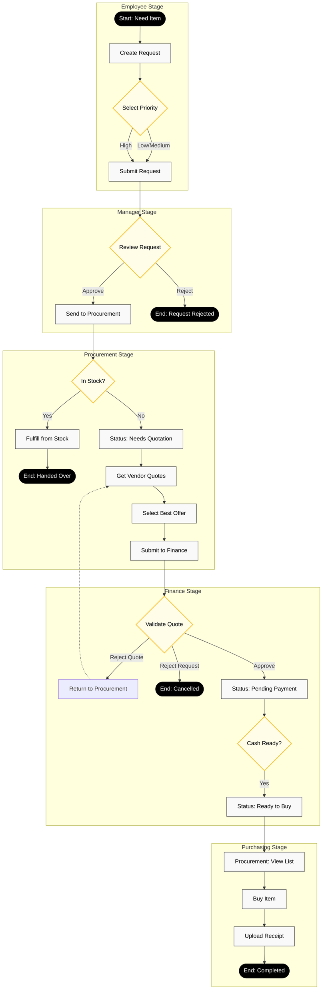

# P2P System Workflow Documentation

This document provides a comprehensive visual and textual guide to the **Click P2P System** workflow. It details the journey of a purchase request from initiation to fulfillment, highlighting the responsibilities of each role.

---

## 🔄 Complete Workflow Diagram

## 📝 Process Description

### 1. Employee (Request)
*   **Action**: Employees log in and create a "New Purchase Request".
*   **Data**: They specify the Item Name, Description, Quantity, and Priority (Low/Medium/High).
*   **Outcome**: Request enters **Pending** status.

### 2. Line Manager / Approver (Review)
*   **Action**: Managers access the "Approval Queue".
*   **Decision**: 
    *   **Approve**: Moves the request to Procurement.
    *   **Reject**: Permanently closes the request with a rejection reason.

### 3. Procurement (Inventory vs. Buy)
*   **Check**: Procurement first checks if the item is available in inventory.
    *   **Yes**: They click **"Fulfill from Stock"**. The process ends here.
    *   **No**: They click **"Request Quotation"**. The status changes to **Needs Quotation**.
*   **Quotations**: Procurement gathers offers from vendors, enters them into the system, and selects the best option (based on price, quality, timeline).

### 4. Finance (Validation & Cash)
*   **Validation**: Finance reviews the *selected quotation*.
    *   **Approve**: Confirms the price and vendor are acceptable.
    *   **Reject Quote**: Sends the request back to Procurement to find a new quote (the request itself is not dead).
*   **Cash Release**: Once approved, the status becomes **Pending Final Payment**. When the cash is physically ready or transferred, Finance marks it **Ready to Buy**.

### 5. Procurement (Purchase)
*   **Execution**: Procurement sees the request in the **Ready to Buy** list.
*   **Completion**: They purchase the item, upload the receipt or invoice as proof, and mark the request as **Completed**.
